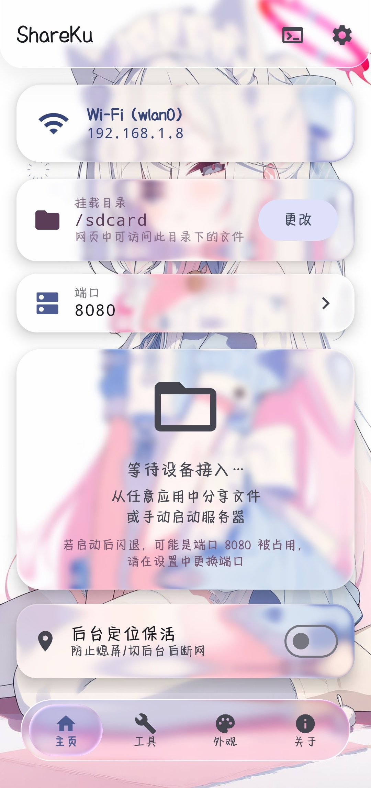
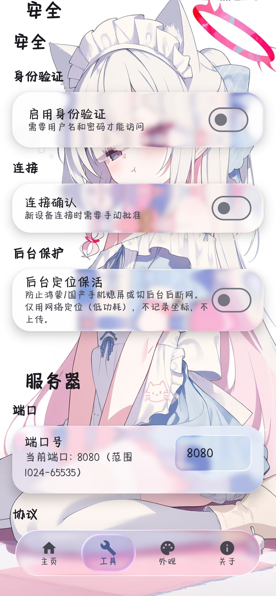
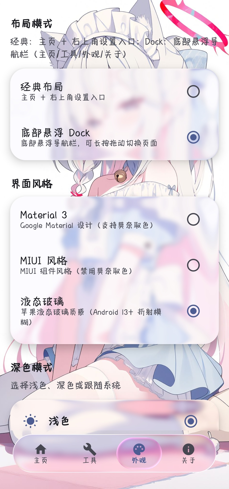

# ShareKu

轻量、优雅的 Android 局域网文件共享工具

[](LICENSE)
[](https://developer.android.com)
[](https://github.com/linlinya520/ShareKu/releases)

## 📸 截图预览

| 主页 | 功能 | 外观 |
|:---:|:---:|:---:|
|  |  |  |

## 🆕 v1.4.0 更新亮点

- **苹果液态玻璃（Liquid Glass）主题**：基于 [Kyant0/backdrop](https://kyant.gitbook.io/backdrop) 的实时折射 / 模糊 / 边缘色散 / 高光 / 投影，全局壁纸作为折射源，玻璃元素跟随内容实时变化
- **全新外观系统**：任意界面风格（Material 3 / MIUI / 液态玻璃）× 两套布局（经典 / 底部悬浮 Dock）
- **全局壁纸系统**：默认壁纸 / 本地图片 / 本地视频 / 系统壁纸，图片与视频均支持**双指缩放 + 拖动定位**，深色模式暗黑遮罩浓度实时预览
- **本地视频壁纸**：循环开关、声音开关、音量滑条一键调节（Media3 播放）
- **液态玻璃滑条**：拇指为真实玻璃球，按住时放大 + 高亮 + 阴影 + 液滴鼓包扭曲，松开即还原
- **首次预渲染引导**：首次启用液态玻璃时自动预渲染全部页面（消除后续使用中的冷启动卡顿），仅出现一次
- **性能大幅优化**：卡片玻璃改用低成本实现（HWUI 阴影 + 静态高光边），页面预组合策略智能调整，重 IO / 图片解码 / 二维码生成全部下沉后台线程
- **安全修复**：修复网页端文件列表 HTML 转义漏洞（恶意文件名注入防护），WebSocket 与删除接口补充鉴权

## 特性

- HTTP 文件共享：一键启动服务器，局域网内任意设备浏览器访问
- 设备直连传输：两台手机都装 ShareKu，App 间直接传文件，无需浏览器
- 双向传输进度：发送端界面与接收端通知栏实时显示传输进度
- 自动设备发现：mDNS(NSD) 扫描附近设备，扫不到可手动输入 IP
- Shizuku 受限目录访问：授权 Shizuku 后可浏览并共享 Android/data 等受限目录
- WebDAV 支持：支持 Windows 7/10/11 映射网络驱动器（含一键生成映射脚本）
- 三套界面风格：Material 3 / MIUI（miuix 组件库）/ 苹果液态玻璃，设置 → 外观随时切换
- 两套布局：经典布局 / 底部悬浮 Dock（长按拖动连续换页）
- 全局壁纸：默认 / 本地图片 / 本地视频 / 系统壁纸，支持裁剪缩放定位与暗黑遮罩调节
- 身份验证 + 一次性验证码：4 位验证码 + 会话令牌，防局域网内改 IP 绕过审批
- 唤醒锁：锁屏 / 切后台时传输不中断
- 灵活挂载：自由选择共享目录，系统文件管理器 / 自带文件浏览器
- 端口自动 Fallback：端口被占用自动尝试下一个
- 分享即共享：从任意应用分享文件，生成二维码 / 链接
- ZIP 打包下载：多文件打包下载，带大小限制保护
- 体积优化：R8 裁切 + 精简依赖，APK 约 4MB（arm64 Release）
- 网页端拖拽上传：拖文件/文件夹到浏览器即上传，支持深色模式
- 控制中心快捷磁贴：一键启动服务器并打开 App
- 桌面小组件：可调整大小，实时显示运行状态与访问地址
- 按 ABI 分架构打包：arm64-v8a / armeabi-v7a / x86_64 / x86 独立 APK

## 技术栈

- 语言: Kotlin
- UI: Jetpack Compose + Material 3 + miuix（MIUI 组件库）+ backdrop（液态玻璃）
- 视频: Media3 ExoPlayer（本地视频壁纸）
- 服务器: Ktor Server (CIO)
- 存储: DataStore Preferences
- 配色: Material Color Utilities (DynamicScheme) + ThemeController (Spec2021)
- 高权限: Shizuku API (UserService)

## 安装

从 [Releases](https://github.com/linlinya520/ShareKu/releases) 下载对应架构的 APK。

### 架构选择

| 架构 | 适用设备 | 文件 |
|------|----------|------|
| arm64-v8a | 绝大多数 2015 年后的手机/平板（推荐） | ShareKu-v1.4.0-arm64-v8a.apk |
| armeabi-v7a | 较老的 32 位 ARM 设备 | ShareKu-v1.4.0-armeabi-v7a.apk |
| x86_64 | 模拟器、部分平板/盒子 | ShareKu-v1.4.0-x86_64.apk |
| x86 | 老式模拟器、部分盒子 | ShareKu-v1.4.0-x86.apk |

不确定架构时，优先选择 arm64-v8a。模拟器用户可在设置中查看 ABI。

## 快速开始

### 浏览器访问

1. 打开 ShareKu，授予存储权限
2. 选择共享目录（默认 /sdcard）
3. 点击「启动服务器」
4. 在电脑浏览器输入显示的地址即可访问

### App 间直连传输

1. 两台手机安装 ShareKu，连接同一 WiFi
2. 两台手机都在主页启动服务器（用于广播设备发现）
3. 进入「设备直连」页，等待扫描到对方设备
4. 选择文件发送，接收端自动保存，双方实时看到传输进度

> 若扫不到设备，可点击「手动输入 IP 连接」输入对方 WiFi IP 直连。

### 液态玻璃 / 壁纸 / Dock 玩法

- **切换到液态玻璃**：设置 → 外观 → 界面风格 → 液态玻璃（Android 13+；首次启用会弹出一次预渲染引导，几秒后即可流畅使用）
- **换壁纸**：设置 → 外观 → 全局壁纸，可选默认 / 本地图片 / 本地视频 / 系统壁纸；选择本地文件后进入裁剪界面，**双指缩放、拖动定位、双指旋转**（快速旋转自动吸附水平 / 垂直，缓慢微调不会吸附），右上角勾确认
- **视频壁纸设置**：选择视频后出现「视频壁纸设置」，可调循环、声音、音量
- **暗黑遮罩**：深色模式下调节遮罩浓度，拖动即时预览
- **动态壁纸**：系统壁纸为动态壁纸（如 Wallpaper Engine）时，「系统壁纸」模式由系统层直接透出显示（该模式下液态玻璃折射自动降级）
- **清除本地壁纸占用**：外观页底部可一键删除已保存的壁纸文件（壁纸将切回「默认壁纸」）
- **Dock 布局**：设置 → 外观 → 布局模式 → 底部悬浮 Dock；Dock 上长按左右拖动可连续换页

> ⚠️ Dock 布局在部分机型帧率下降较明显（每个玻璃元素移动时需重新采样背景），作者仍在优化中。有思路的朋友欢迎提 Issue。

### Windows 映射网络驱动器（Win7/10/11）

1. 启动服务器并确保开启 WebDAV
2. 到网页端（底部剪贴板面板旁的按钮）点击「下载映射脚本」
3. 将脚本保存为 .bat 双击运行（无需管理员）

> 若提示错误码 67，需先在系统「可选功能」中启用「WebDAV 客户端」并重启电脑。

### Shizuku 受限目录访问

Android 11+ 对 /storage/emulated/0/Android/data 等目录有访问限制，普通文件 API 无法读取。授权 Shizuku 后 ShareKu 可以：

1. 安装并启动 [Shizuku](https://shizuku.rikka.app/)（需要 adb 或 root 授权）
2. 在 ShareKu 的目录选择界面切换到「Shizuku 模式」
3. 浏览并选择受限目录（如 /storage/emulated/0/Android/data 下的应用目录）
4. 启动服务器后，浏览器端可以真正列出并下载该目录中的文件

注意：

- 受限目录的共享目前支持列表与下载；上传、删除、WebDAV、ZIP 打包暂不支持
- 若共享目录受限但 Shizuku 未授权，启动服务器时会提示网页端无法访问
- Android/data 目录下每个文件夹通常对应一个应用包名，文件夹图标右下角会显示对应应用图标，方便定位

## 安全

- 连接确认：新设备访问时手机端弹出一次性 4 位验证码，对方输入后签发绑定 IP 的 24h 会话令牌（验证码连续输错 5 次将锁定 5 分钟）
- 令牌绑定 IP：局域网内即使修改 IP 也无法绕过审批
- 可选 Basic Auth：提供额外的用户名 / 密码身份验证
- WebDAV 映射凭据：仅开启「连接确认」时，映射时认证框密码填网页上验证后显示的 24h 令牌；开启「身份验证」时填用户名 / 密码即可；两者都开启时任选其一通过
- 设备直连接收：接收端自动保存文件（完成通知会显示来源 IP），可在「文件操作」页关闭接收；分享页产生的临时服务器不接受直连推流
- 网页端文件名 / 路径全量 HTML 转义，防注入
- 本软件仅供局域网使用，在公共局域网使用可能存在文件泄露风险

## 构建

```bash
git clone https://github.com/linlinya520/ShareKu.git
cd ShareKu
./gradlew assembleRelease
```

需要 Android SDK 36 + JDK 17。构建产物按 ABI 拆分四个 APK，输出在 app/build/outputs/apk/release/。

## 致谢

- [backdrop](https://github.com/Kyant0/backdrop) — 液态玻璃（折射/模糊/色散）
- [miuix](https://github.com/compose-miuix-ui/miuix) — MIUI 组件库
- CINXZ — miuix 组件参考
- [aShellYou](https://github.com/DP-Hridayan/aShellYou) — UI 设计灵感
- [InstallerX](https://github.com/iamr0s/InstallerX) — 技术参考
- [Shizuku](https://github.com/RikkaApps/Shizuku) — 高权限访问方案

---

Made with love by Lin Jing
